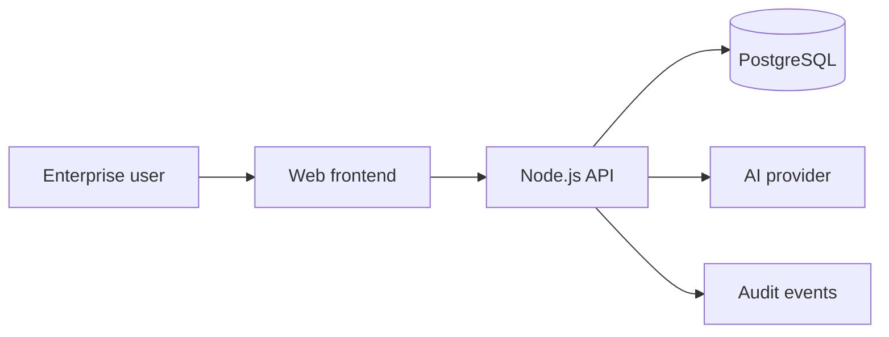
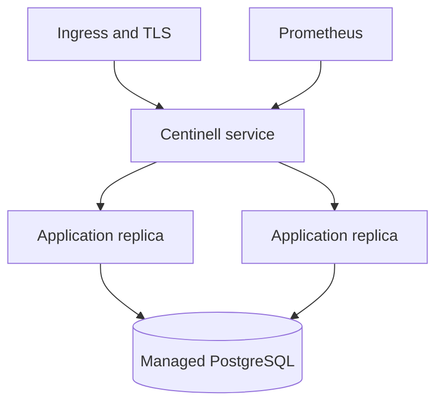

# Centinell Forensics Enterprise Architecture

## System context

The browser never receives database or AI provider credentials. Authentication is held in an HTTP-only, secure, same-site cookie. Every business query includes the authenticated organization identifier; roles control privileged operations.

## Deployment topology

Railway is the initial managed deployment target. Kubernetes and Terraform manifests provide a migration path for regulated or larger customers. Secrets must come from the deployment platform and never from Git.

## Trust boundaries

1. Public internet to TLS ingress.
2. Browser to authenticated API.
3. API to tenant-scoped PostgreSQL.
4. API to approved AI provider with minimal necessary context.

Evidence binaries require a dedicated encrypted object store and signed evidence manifests before production evidence ingestion is enabled.
