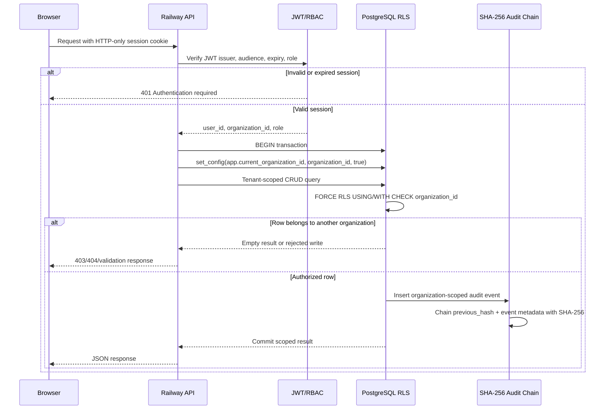
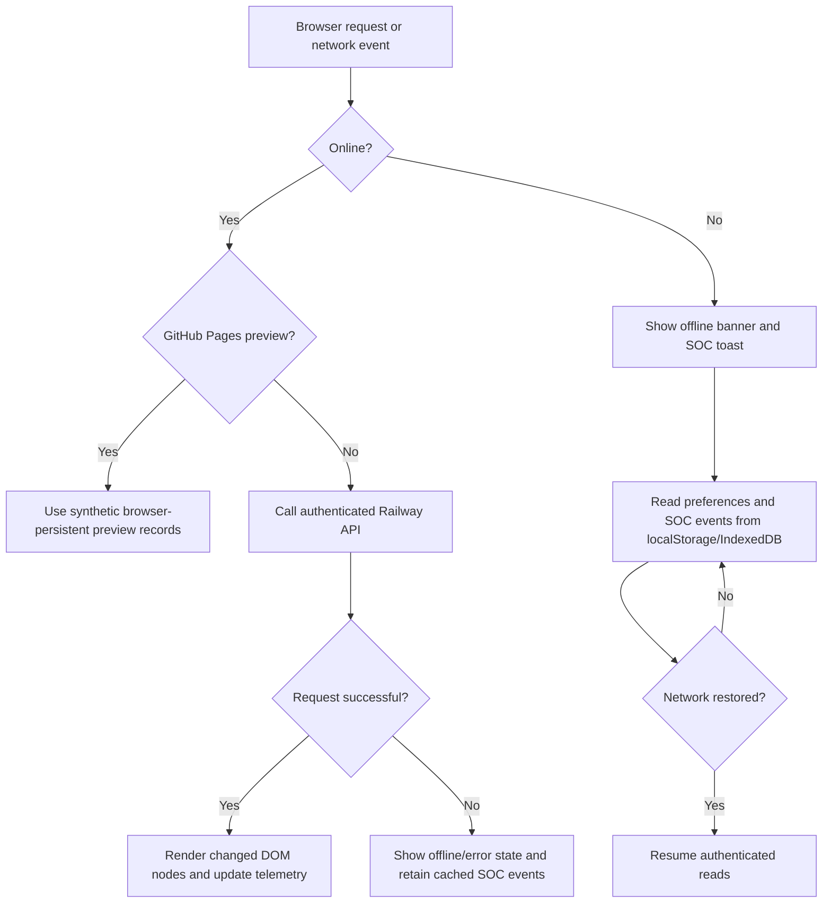

# Pull Request #1 — Reviewer's Guide

## Review objective

Validate the corporate Command Center expansion, deep hash routing, tenant-scoped CRUD, audit integrity, modular frontend architecture, offline behavior, and accessibility without treating preview-only behavior as production integration.

## Test coverage matrix

| Area | Automated verification | Test type | Error or boundary coverage | Current status |
|---|---|---|---|---|
| Command Center and deep routes | `backend/test/enterprise-navigation.test.js` | Static integration | Confirms router, persistent store, analysis modal, nested corporate routes, and module views exist | Passing |
| AI Forensics | `enterprise-navigation.test.js`, `smoke.test.js` | Static + smoke | Server-mediated AI route; missing provider key returns `503` | Passing |
| Support Center | `enterprise-navigation.test.js` | Static integration | Route, records, telemetry, evidence, report, and settings controls | Passing |
| CRM Integration | `enterprise-navigation.test.js` | Static integration | Salesforce is explicitly connector-ready, not represented as live | Passing |
| Websites | `enterprise-navigation.test.js` | Static integration | Workspace routing and records; external uptime probe is not yet implemented | Passing with documented gap |
| Social Intelligence | `enterprise-navigation.test.js` | Static integration | Workspace routing and persistent preview records | Passing |
| Call Rates | `enterprise-navigation.test.js` | Static integration | Workspace routing, reports, and browser persistence | Passing |
| Corporate CRUD API | `enterprise-navigation.test.js` | Static backend contract | GET/POST/DELETE require authentication; writes require `admin` or `analyst` | Passing |
| PostgreSQL tenant isolation | `backend/test/rls.integration.test.js` | Database integration | Cross-tenant reads and writes are denied by forced RLS | Passing in Enterprise CI; skipped locally without `DATABASE_URL` |
| Audit hash chain | `security.test.js`, database trigger and verifier | Unit + integration | Detects altered or reordered audit events | Passing |
| Evidence encryption | `security.test.js` | Unit | AES-256-GCM round trip and tamper detection | Passing |
| ABAC/RBAC policy | `security.test.js` | Unit | Deny overrides allow; MFA and device conditions enforced | Passing |
| Investigation console | `investigation-console.test.js` | Unit | Rejects shell syntax; bounds packet input; defensive allowlist only | Passing |
| Modular frontend architecture | `enterprise-navigation.test.js` | Static integration | Router, Store, API, Lifecycle, IndexedDB cache, debounce/throttle, RBAC UI | Passing |
| Container and server startup | `smoke.test.js`, Enterprise CI | Smoke/build | Loads server without listener and builds Docker image | Passing |
| Dependency vulnerabilities | `npm run security-scan`, Enterprise CI | Dependency/static checks | Fails on high-severity npm audit findings | Required before merge |

## Authentication and PostgreSQL RLS sequence



Security invariants:

- The browser never supplies the trusted tenant context; `organization_id` comes from the verified session.
- Tenant operations execute inside `withTenant()` and a database transaction.
- `FORCE ROW LEVEL SECURITY` remains active even if application filtering is accidentally omitted.
- JWTs are stored in secure HTTP-only cookies, not `localStorage`.
- UI RBAC improves usability but the backend role check remains the authorization boundary.

## Offline fallback flow



Current boundary: IndexedDB stores local SOC events and preferences. Production CRUD writes are **not queued or replayed automatically** after reconnection. A durable outbox with conflict resolution must be implemented before claiming offline write synchronization.

## Security and CodeQL verification

Install the locked dependencies and run the repository security gate:

```bash
npm ci
npm run security-scan
```

`security-scan` runs:

```bash
npm audit --audit-level=high
npm run check
npm test
```

GitHub CodeQL is authoritative for this pull request and runs through `.github/workflows/codeql.yml`. Confirm both checks before merge:

- **Enterprise CI** — dependency audit, syntax, tests, RLS integration, and container build.
- **CodeQL Security** — JavaScript static security analysis.

Optional GitHub CLI review:

```bash
gh pr checks 1 --repo Centinell2025/ForensicCentinellDashboard1
gh run list --repo Centinell2025/ForensicCentinellDashboard1 --limit 10
```

Do not place `JWT_SECRET`, database credentials, API keys, Vault tokens, or Salesforce OAuth secrets in the repository or GitHub Pages bundle.

## Accessibility compliance log

| Control | Implemented behavior | Verification |
|---|---|---|
| Navigation buttons | Native `<button>` elements support `Tab`, `Enter`, and `Space` | Keyboard walkthrough required |
| Metric cards | `tabindex="0"`, link role, `Enter` and `Space` activation | Covered by source assertion; manual walkthrough required |
| Record rows | Keyboard focus, button role, `Enter` and `Space` drill-down | Covered by source assertion; manual walkthrough required |
| Technical modal | `role="dialog"`, `aria-modal="true"`, labelled title, Escape close | Source verified; focus trapping remains pending |
| Toasts | Existing status toast uses `role="status"` and `aria-live="polite"` | Source verified |
| Command module host | `aria-live="polite"` for dynamic workspace updates | Source verified |
| Console output | Focusable `<pre>` and text output that does not depend on color alone | Manual screen-reader review required |
| Offline status | Text status plus color, not color-only signaling | Manual contrast review required |
| Responsive tables | Horizontal wrapper preserves data access on narrow screens | Mobile keyboard/touch review required |
| Theme control | Native button and persistent theme preference | Automated contrast testing remains pending |

Known accessibility work remaining:

- Trap focus inside open modals and return focus to the invoking control.
- Add automated axe-core/Playwright checks.
- Verify WCAG 2.2 AA contrast in both themes.
- Add skip navigation and a programmatic main-content focus target.
- Confirm screen-reader announcements for dynamic chart and telemetry updates.

## Reviewer execution checklist

1. Confirm Enterprise CI and CodeQL show `success` for the current head commit.
2. Run `npm ci && npm run security-scan` locally.
3. Open direct routes, reload, and use browser back/forward navigation.
4. Test `Tab`, `Enter`, `Space`, and `Escape` without a mouse.
5. Create records in two test organizations and confirm RLS prevents cross-tenant access.
6. Disconnect the network and confirm the banner, toast, cached events, and recovery behavior.
7. Verify CSV, TXT, print/PDF, and evidence-note SHA-256 exports.
8. Confirm no production secret exists in source, browser storage, logs, or the built bundle.
9. Approve merge only after all required checks pass on the final commit.
